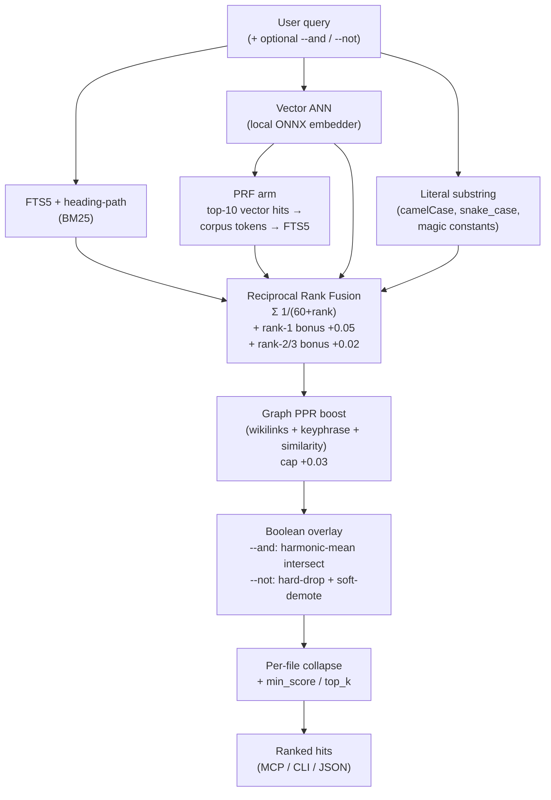

<div align="center">
  
</div>

---

**dora turns a folder of notes — or a code repo — into something Claude (and Cursor / Codex) can search by meaning, navigate by symbol, and rank by relevance, not just by keyword.**

You point dora at a directory — your Obsidian vault, work notes, project docs, *or a Rust/Python/TS/Go/Java/Ruby codebase*. It builds a tiny local search index next to those files. Then:

- **From Claude Code**: ask *"what did I write about hook design?"* and Claude pulls the actual passage. Or *"where is `Embedder` implemented?"* and it pulls the impls — by symbol, not by grep.
- **From your terminal**: type `grep "the bit I half-remember about ranking"` and get the right note ranked first.
- **As a tool you call directly**: `dora "any natural language query"` returns ranked hits with a one-line excerpt.

For code, dora ships with `find_definition`, `find_callers`, `find_implementations`, and `repo_map` (PageRank-ranked outline of the most important files for what you're currently editing).

That's the whole product. One small binary. Local-only by default — no API key, no cloud, no daemon, no kernel-level filesystem trickery. If you want cloud embeddings (OpenAI) for better quality, that's a one-line config change.

## What it actually looks like

After a one-time setup:

```sh
$ cd ~/notes
$ grep "hooks matter more than the body"
x/Hooks matter more than content.md:1: The first line of any post does more work...
post/Houston you have a data problem.md:14: ...if your hook doesn't earn the second sentence...
```

That's not literal grep — that's *semantic* search. dora hijacks flagless `grep` (and `rg`, `ag`, `find`) when you're inside a registered notes folder. `grep -i pattern` and any flagged form still call real grep.

In Claude Code (after `dora install`):

```
You    > what did I decide about the embedder trait?
Claude > [calls mcp__dora__search]
       > You decided to defer extracting the trait until a real second impl
       > (OpenAI) was in scope, per smfs's lesson — quoted from:
       >   technology/Defer trait abstraction until the second impl.md
       >   "Single trait in code with one impl. We deliberately defer the
       >    trait abstraction until there's a second use case to motivate
       >    the shape — same lesson stash's BaseEmbedder teaches."
```

## Install

> macOS Apple Silicon (M1 / M2 / M3+). Intel Mac and Linux: build from source via `cargo install --git https://github.com/rach/dora --tag v0.2.0`.

### Homebrew (recommended)

```sh
brew install rach/dora/dora
```

The first run auto-taps `rach/homebrew-dora`. Upgrade with `brew upgrade dora`.

### Direct download

```sh
curl -L -o /tmp/dora https://github.com/rach/dora/releases/latest/download/dora-fs-v0.2.0-macos-arm64
chmod +x /tmp/dora
xattr -d com.apple.quarantine /tmp/dora 2>/dev/null   # bypass macOS Gatekeeper warning
sudo mv /tmp/dora /usr/local/bin/dora                  # or anywhere on your $PATH
dora --version
```

Either path lands you at:

```
dora 0.2.0
```

> **About the Gatekeeper line** (direct-download path only): the binary isn't code-signed (signing requires a $99/yr Apple developer account I haven't paid for). The `xattr` line removes the quarantine flag macOS adds to downloads, so it'll launch without complaining. Homebrew's install path doesn't trip Gatekeeper. If you skip the `xattr` on a direct download, the first run shows *"cannot be opened because the developer cannot be verified"* — right-click in Finder → Open → "Open Anyway" gets past it.

## Tutorial — your first search in 5 minutes

This walks you through indexing a folder of notes, wiring it into Claude Code, and running your first query. Replace `~/notes` with your actual notes folder (Obsidian vault, dump of markdown files, etc.).

### Step 1 — Index your notes

```sh
dora index ~/notes
```

You should see something like:

```
indexed: 73 inserted, 0 updated, 0 touched, 0 renamed, 0 deleted, 0 unchanged in 14.81s [model: fastembed:Qdrant/bge-base-en-v1.5-onnx-Q]
```

What just happened: dora walked `~/notes`, chunked each `.md` file, embedded each chunk using a small local ML model (auto-downloads ~80 MB the first time, cached for next time), and stored the result in `~/notes/.dora/index.db`. The first run takes seconds-to-minutes depending on vault size. Subsequent runs are basically instant for unchanged files.

### Step 2 — Register the folder so dora knows about it globally

```sh
dora source add ~/notes
```

You should see:

```
added: notes -> /Users/you/notes
```

Optional but recommended — describe what the folder contains. This is shown to Claude when it's picking which source to search:

```sh
dora source describe notes "Personal notes and journal entries"
```

You can register more folders any time:

```sh
dora index ~/work-notes
dora source add ~/work-notes --name work --description "Work meeting notes + design docs"

dora index ~/Dev/myproject/docs
dora source add ~/Dev/myproject/docs --name proj-docs

dora source list
```

### Step 3 — Try a query from the terminal

```sh
cd ~/notes
dora "what did I write about hooks?"
```

You should see ranked hits — each line is `path:line: snippet`:

```
x/Hooks matter more than content.md:1: The first line of any post does more work than the next ten...
post/Houston you have a data problem.md:14: ...if your hook doesn't earn the second sentence, the rest...
```

This is *semantic* search — it matches by meaning, not just literal keywords.

### Step 4 — Wire it into Claude Code (+ Cursor + Codex)

```sh
dora install
```

This:
- Adds a `dora` MCP server entry to `~/.claude.json`, `~/.cursor/mcp.json`, and `~/.codex/config.toml` (skips any that aren't installed).
- Adds zsh wrappers to `~/.zshrc` for `grep`, `rg`, `ag`, `find` (so e.g. `grep "natural query"` inside `~/notes` runs dora instead of literal grep).

You should see something like:

```
MCP hosts:
  Claude   patched (/Users/you/.claude.json)
  Cursor   patched (/Users/you/.cursor/mcp.json)
  Codex    not installed (/Users/you/.codex/config.toml)

Shell wrappers:
  grep   added to ~/.zshrc
  rg     added to ~/.zshrc
  ag     added to ~/.zshrc
  find   added to ~/.zshrc
  (`source ~/.zshrc` or open a new shell)
```

**Restart Claude Code** (and Cursor / Codex) so they pick up the new MCP server.

### Step 4.5 — (Optional) Install the bundled `dora` skill

Without this skill, Claude often still reaches for `Grep` when you ask code or notes questions — exactly the failure mode dora was built to fix. The bundled skill tells Claude *when* to prefer dora's MCP tools (`find_definition`, `find_callers`, `repo_map`, `search`, etc.). Quickest install:

```sh
npx skills add rach/dora
```

Or via the Claude Code plugin marketplace:

```
/plugin marketplace add github.com/rach/dora
/plugin install dora@dora
```

Full options (manual symlink, per-project install, troubleshooting) in [skills/README.md](skills/README.md).

### Step 5 — Verify everything's healthy

```sh
dora doctor
```

You should see all green ✓ checks. If anything is `⚠` or `✗`, the message tells you what to fix.

### Step 5.25 — (Optional) Persistent HTTP daemon (multi-client setups)

If you have multiple MCP clients (Claude Code + Cursor + Codex, or several
Claude Code workspaces in parallel), each one launches its own `dora mcp` stdio
subprocess and reloads ~80 MB of ONNX weights into RAM. Painful at cold start.

Switch to the shared HTTP daemon instead:

```sh
dora mcp --http --daemon          # forks into the background, PID at ~/.config/dora/mcp-http.pid
dora mcp status                   # uptime + source list
dora mcp stop                     # SIGTERM (escalates to SIGKILL after 5s)
```

Or run it as a launchd service via Homebrew (auto-starts on login, restarts on crash):

```sh
brew services start dora          # service definition runs `dora mcp --http`
```

When the daemon's alive, **`dora install`** auto-detects it and writes
`{"url": "http://127.0.0.1:8181/mcp"}` into each MCP client's config instead of
the stdio launch command — clients connect over HTTP and share the loaded models.

If you shut the daemon down later, re-run `dora install` to flip clients back to
stdio. `dora doctor` shows the daemon's state under MCP DAEMON.

### Step 5.5 — (Optional) Run a background watcher

Without a watcher, dora self-heals on every query (it diffs the vault if mtimes changed since the last walk). With one, you skip that mid-query catch-up and indexing is always already-fresh.

`brew services start dora` runs the HTTP daemon (see Step 5.25), not watch — Homebrew formulas only support one service block. For the watcher, run it manually:

```sh
dora watch                                              # foreground; Ctrl-C to stop
nohup dora watch > /tmp/dora-watch.log 2>&1 &           # background
```

The watcher auto-picks up any source you add later via `dora source add` — no restart needed. `dora source add` prints a hint telling you whether a watcher is already running or not. **Safe to start before registering any sources** — the watcher waits and picks up the first `dora source add` automatically.

If you want watch to start on login like brew-services would, write a per-user launchd plist at `~/Library/LaunchAgents/dora-watch.plist` pointing at `/opt/homebrew/bin/dora watch`. (v0.2.1–v0.4.x users whose `brew services start dora` ran watch automatically should follow this step after upgrading to v0.5.)

### Step 6 — Use it from Claude Code

In a fresh Claude Code session, ask Claude something that requires your notes:

```
> What did I decide about the embedder trait?
```

Claude will call `mcp__dora__search` automatically, pull the relevant passages from your notes, and quote them back. No more "I don't have access to your files." You can also ask "what sources does dora have?" — Claude calls `mcp__dora__list_sources` and tells you what's registered.

### Bonus — semantic grep in your terminal

After `dora install`, inside any registered folder:

```sh
cd ~/notes
grep "natural language query"        # → semantic search via dora
rg "system design decisions"          # → semantic search via dora
ag "concurrent state"                 # → semantic search via dora

# Flag forms always fall through to the real tool:
grep -F "literal pattern"             # → real grep
rg --files                            # → real ripgrep
```

If the underlying tool isn't installed (e.g., you don't have ripgrep), the wrapper is harmless — `command rg "$@"` just errors the same as if no wrapper existed.

**Turning the wrappers off temporarily.** If you want `grep` to behave like real grep again — for a debugging session, a script, or just permanently — flip the toggle:

```sh
dora wrappers off       # `grep`/`rg`/`ag`/`find` pass through to the real tool
dora wrappers on        # back to routing flagless calls into dora
dora wrappers status    # which mode is active
```

The state lives in `~/.config/dora/config.toml` and survives shells + reboots. No need to edit `.zshrc`. The wrappers stay installed; they just delegate when the toggle is off.

### Keeping things fresh

dora's incremental indexing means re-running `dora index` is cheap. Queries also self-heal — if you've edited a file since the last index, the next query notices and quietly catches up before searching. So you don't *have* to do anything. If you want instant results without that mid-query refresh (and auto-pickup of newly-added sources), run `dora watch` — see [Step 5.5](#step-55--optional-run-a-background-watcher) above.

## What's happening under the hood

```
~/your-notes/
├── note.md                ← you write these
├── deep/folder/...
└── .dora/                 ← dora writes here only (gitignorable)
    ├── index.db           ← local SQLite database with the search index
    └── models/            ← downloaded ML model (~33 MB, one time)

~/.config/dora/
└── registry.toml          ← list of folders you've registered
```

### Retrieval pipeline



### Choosing an embedder

dora defaults to `bge-base-en-v1.5-onnx-q` (Qdrant's int8-quantized BGE-base). It hits the sweet spot of the accuracy / size / cold-start curve on the maintainer's 53-query eval fixture — same R@1 as a model 10× its size, and faster to load than a smaller-but-non-quantized alternative. You don't need to change this unless you have a specific reason.

| Model | Size | R@1 | MRR | Notes |
|---|---|---|---|---|
| `bge-small-en-v1.5` | ~30 MB | 0.868 | 0.928 | lightest; fine for tiny corpora |
| **`bge-base-en-v1.5-onnx-q`** *(default)* | ~33 MB | **0.943** | **0.965** | quantized, ties full-prec embeddinggemma |
| `bge-base-en-v1.5` | ~110 MB | 0.925 | 0.956 | full precision, marginal lift over the quantized version |
| `embeddinggemma-300m-onnx` | ~333 MB | 0.943 | 0.967 | matches qmd's embedder; +0.2pt MRR for 10× the size |

Numbers from `~/.dora-eval-hard/` (20 docs, 53 queries — easy / medium / hard mix). PRF on for all rows. Your corpus may shift these by a few points; the relative ordering is stable. For a head-to-head, dora's full hybrid stack (bge-base-Q + FTS + literal + PRF) lands at 0.943 R@1 against qmd's LLM-augmented pipeline at 0.962 — a 1.9pt gap with no LLM dependency.

OpenAI is supported via `provider = "openai"` (`text-embedding-3-small` / `text-embedding-3-large` / `ada-002`). Pay-per-use, no local model, costs surface in the index summary.

To switch, edit `<source>/.dora/config.toml`:

```toml
[embedder]
provider = "fastembed"
model = "embeddinggemma-300m-onnx"  # or any other fastembed-supported code
```

The next `dora index` will detect the change, wipe the old vectors, and re-embed from scratch — the index DB tracks `embedder_id` and refuses to mix vectors from different models.

**Indexing.** dora reads each `.md` file, splits it into chunks (respecting headings, code blocks, tables), generates a vector embedding per chunk using a small local ML model (default: a quantized BGE-base, ~33 MB ONNX file that runs on your laptop). Stores everything in SQLite alongside an FTS5 index.

**Searching.** When you query, dora embeds the query the same way, then runs four searches in parallel: a keyword-based one (BM25 / FTS5 over the chunk content + heading path), a vector-similarity one, a literal-substring scan (so identifier-shape queries like `processRequest` or `E_NOENT` work natively without falling through to `rg`), and a pseudo-relevance feedback arm (the top vector hits' most-frequent non-stopword tokens become a second FTS5 query — closes vocabulary gaps without an LLM). All four ranked lists merge via Reciprocal Rank Fusion. The merged list then gets a small graph-PPR boost (chunks densely connected to the top hits via `[[wikilinks]]` or keyphrase/similarity edges surface a bit higher — associative recall without an LLM). If you passed `--and`/`--not`, the boolean overlay intersects/excludes against those side queries. You get the top N results back.

**Boolean search (v0.7).** dora supports `--and` and `--not` flags (also `and`/`not` arrays on the MCP `search` tool):

```sh
dora "auth"          --and "rate limit"        # intersection: chunks about both
dora "caching"       --not "Redis"             # exclusion: caching but not Redis
dora "X" -a "Y" -a "Z" -n "W"                  # compose: (X ∩ Y ∩ Z) \ W
```

Each `--and` adds another hybrid search; the combined score is the harmonic mean of normalized per-query scores (asymmetry is punished — strong on X, weak on Y ranks below moderately strong on both). `--not` hard-drops chunks scoring above 0.5 for the not-term and soft-demotes weaker matches.

**Document graph (v0.7).** dora parses `[[wikilinks]]` and `[text](note.md)` links from your markdown into a graph and derives additional edges from keyphrase co-occurrence + embedding similarity. Surfaced via `dora backlinks <note>` (who links to this), the `backlinks` MCP tool, and the PPR boost above. Rebuild on demand with `dora graph rebuild`. No LLM, no Python — explicit links + statistical extraction.

**Usage logging.** Every search records its query and returned chunk IDs to a local `usage` table — data-collection-only today, the input for a future signal-based reranker and v0.9's in-process LoRA fine-tuning. No telemetry leaves your machine.

**Incremental.** After the first index, only changed files get re-embedded. Detected via mtime + content hash. Renames are detected and don't re-embed. Even on a vault with 2,500+ chunks (e.g. the Rust Book), a no-op re-index takes about 130 milliseconds.

**Self-healing.** When you query, dora notices if any files changed since the last walk and quietly catches up before searching. So results are always fresh, even if you forgot to re-index.

**Multi-folder.** All registered folders are searchable from a single MCP server (one process, one model in memory). Claude can scope a search to one folder by name, or search across everything and merge results.

## Modes

A *mode* is a complete preset — chunker, embedder, file-extension filter, and ignore-directories — that you pick (or auto-detect) per source. Set it via `dora source add --mode <mode>` or by editing `[source] mode = "..."` in the source's `.dora/config.toml`.

| Mode | Chunker | Default embedder | File extensions | Auto-detect trigger |
|---|---|---|---|---|
| `obsidian` | adaptive markdown + frontmatter synthesis | `bge-base-en-v1.5-onnx-q` | `.md` | `.obsidian/` directory exists |
| `notes` | adaptive markdown | `bge-base-en-v1.5-onnx-q` | `.md` | `.md` files majority, no `.obsidian/` |
| `docs` | adaptive markdown, smaller chunks | `bge-base-en-v1.5-onnx-q` | `.md`, `.mdx`, `.rst` | explicit only |
| `code` | tree-sitter (6-language registry) | `jina-embeddings-v2-base-code` | `.rs`, `.py`, `.ts`, `.tsx`, `.js`, `.jsx`, `.go`, `.java`, `.rb` | code-extension majority |
| `claude-code` | per-user-turn JSONL chunker (project + timestamp + branch as heading) | `bge-base-en-v1.5-onnx-q` | `.jsonl` | path ends with `.claude/projects` |
| `codex` | per-user-turn JSONL chunker for OpenAI Codex CLI transcripts | `bge-base-en-v1.5-onnx-q` | `.jsonl` | path ends with `.codex/sessions` |
| `auto` | resolved at index time | (resolved) | (resolved) | default — runs the rules above |

```sh
$ dora source add ~/Dev/personal/brain
mode: obsidian (auto-detected — `.obsidian/` directory present)
added: brain -> /Users/me/Dev/personal/brain

$ dora source add ~/Dev/myproject --mode code
mode: code (412 .md files, 1873 code-extension files)
added: myproject -> /Users/me/Dev/myproject
```

Modes are sensible defaults — every individual knob (`[chunking]`, `[embedder]`, `[vault] ignore`) can still be overridden in `.dora/config.toml`.

## Using dora with code

Pointed at a Rust / Python / TS+JS / Go / Java / Ruby repo with `--mode code`, dora chunks files structurally via tree-sitter (one chunk per function / method / class / etc.) and builds a symbol graph in the same SQLite DB. Five MCP tools become useful:

- `mcp__dora__search(query, source?, ...)` — semantic search, same as for notes. Best for "find code that does X".
- `mcp__dora__find_definition(symbol, source?)` — locate where a symbol is defined. Cheap, exact.
- `mcp__dora__find_callers(symbol, source?, depth=1)` — recursive walk over the call graph. Each result carries `confidence: "exact" | "name_match"` (within-file or unique-name matches are `exact`; ambiguous matches across files are `name_match`).
- `mcp__dora__find_implementations(symbol, source?)` — find implementations of a trait / interface (Rust `impl Trait for ...`, Java/TS `implements`).
- `mcp__dora__repo_map(source, focus_paths=[], token_budget=2000)` — PageRank-ranked outline of the codebase. `focus_paths` (file path prefixes you're editing) biases ranking toward neighbors of those files. Aider's "what code matters for the current task" view.

Tree-sitter only — no LSP required, no per-language setup, no language server processes hanging around. Cross-file edges are resolved by symbol-name match against the index; resolution rate is honest about ambiguity via the `confidence` field.

Quickstart:

```sh
cd ~/Dev/myproject
dora index             # auto-detects mode=code if code files dominate; first run downloads jina-embeddings-v2-base-code (~150 MB)
dora source add . --mode code --description "myproject — Go backend"
# from Claude Code:
#   "where is `processRequest` defined?"           → find_definition
#   "what calls `processRequest`?"                 → find_callers
#   "give me a ranked outline of this repo,         → repo_map(focus_paths=[...])
#    focused on backend/auth/"
```

`dora doctor` shows the per-source mode and chunk-kind breakdown:

```
REGISTRY
  · registry      2 source(s) registered
  ✓ brain         /Users/me/brain, mode=obsidian, embedder=fastembed:Qdrant/bge-base-en-v1.5-onnx-Q
  ✓ myproject    /Users/me/Dev/myproject, mode=code, embedder=fastembed:jinaai/jina-embeddings-v2-base-code,
                  function=412 method=288 class=156 module=47 interface=18, 9214 links
```

## Indexing your Claude Code sessions

dora can also index every Claude Code session you've ever had — the JSONL transcripts that live at `~/.claude/projects/<encoded-cwd>/<session>.jsonl`. Once indexed, "that session where I built X" or "what was the rg command we ran 40 turns ago" become semantic search queries.

```sh
dora index ~/.claude/projects
dora source add ~/.claude/projects
```

Auto-detects to `mode=claude-code` and names the source `claude-code`. Each user-turn becomes one chunk (one user prompt + the assistant text + tool calls until the next user prompt); the `heading_path` is `<project> · <iso-minute> · branch:<git-branch>` so search results show *which* project a session came from (not the ugly encoded folder name).

The active session (the one Claude Code is writing to *right now*) is skipped automatically — files whose mtime is within the last `[claude_code] settle_seconds = 60` window are excluded, so re-indexing while you're working doesn't burn the embedder. Reported as `N settling` in the index summary.

`thinking` blocks are excluded by default. Flip on via:

```toml
[claude_code]
include_thinking = true
settle_seconds   = 60
```

Cross-source queries (notes + code + transcripts in one tool call) just work — `mcp__dora__search` returns merged hits across every registered source.

**Codex CLI transcripts** follow the same pattern via the `codex` mode:

```sh
dora index ~/.codex/sessions
dora source add ~/.codex/sessions
```

Auto-detects `mode=codex`, defaults the source name to `codex`. Each hit's `heading_path` ends with `· codex` (vs `· branch:<branch>` for claude-code), so mixed cross-source search results stay distinguishable. `reasoning` blocks (Codex's analog of `thinking`) are skipped by default; opt back in via `[codex] include_reasoning = true`. Codex `function_call_output` text gets its standard `Chunk ID: … / Wall time: … / Output:\n` metadata header stripped so the indexed prose is just the real tool output.

## Commands

```
dora index [<path>]                                              # build/update the index for <path> (defaults to cwd)
dora "<query>" [--top-k N] [--json] [--min-score F] [--all] [--files]
                                                                 # search the index in cwd
dora source add <path> [--name N] [--description "…"] [--mode M] # register a folder; --mode obsidian|notes|docs|code|auto|claude-code|codex
dora source list                                                 # show registered folders
dora source remove <name>                                        # unregister
dora source describe <name> "…"                                  # update a folder's description
dora context add <source> <prefix> "<text>"                      # attach a context description to a subpath; surfaced on every hit under it
dora context list <source>                                       # show registered contexts
dora context remove <source> <prefix>                            # drop a context entry
dora install [--client …] [--include …] [--wrap …]               # patch MCP host configs + shell wrappers
dora doctor                                                      # health check, exit code reflects status
dora mcp [--include …] [--exclude …] [--source <path>]           # run the MCP server (usually called by Claude Code itself)
dora watch [--include …] [--exclude …]                           # foreground watcher that keeps things fresh proactively
dora wrappers <on|off|status>                                    # toggle the grep/rg/ag/find shell wrappers without editing ~/.zshrc
dora mcp --http [--bind ADDR] [--port N] [--daemon]              # serve MCP over HTTP for multi-client setups (one persistent process, resident models)
dora mcp <stop|status>                                           # SIGTERM the http daemon / report uptime
```

### Output modes for agents

Three flags compose to express common agentic-flow shapes — supported on both the CLI
and the MCP `search` tool (as `min_score: number`, `all: bool`, `output: "files"|"chunks"`).

- `--min-score 0.05` — drop hits below an RRF score threshold. Replaces hand-tuning `--top-k`.
- `--all` — disable the top-K cap; return every hit that passed `--min-score`.
- `--files` — dedupe by path; print one line per file (no `:line:`, no snippet).

```sh
# Every note that even loosely matches, by file:
dora "design decisions" --all --min-score 0.04 --files

# Same shape from an agent via MCP:
mcp__dora__search({query: "design decisions", all: true, min_score: 0.04, output: "files"})
```

There's also a peer tool **`multi_get`** that batch-reads documents by glob:
`mcp__dora__multi_get({source: "dora", pattern: "src/**/*.rs"})`. Use it instead of
N×Read once you already know which files you want.

### Per-subpath contexts

Attach a description to a path prefix inside a source; it surfaces alongside every hit
under that subtree, so agents see *"this lives in the API reference"* without having to
guess from the path.

```sh
dora context add brain /technology "Engineering and design nuggets"
dora context add brain /sources    "Quoted source material — verbatim, not my words"
dora context list brain
```

Conventions:
- `/` is the source-wide default.
- Subtree prefixes (`/foo`) override the global one (longest-match wins).
- Boundary-safe — `/foo` doesn't accidentally match `/foobar`.

Every command has a `--help`. Full reference (with examples for each command, config file format, embedding-model choices, and Claude Code wiring details) is below.

## Full reference

### `dora index [<path>] [--dry-run]`

Incremental index. First run does everything; subsequent runs only re-embed changed files. Atomic per-file. `--dry-run` walks + chunks but doesn't embed; useful with OpenAI to preview cost.

```sh
dora index                         # cwd
dora index ~/notes                 # specific folder
dora index --dry-run               # show what would happen + estimated cost
```

### `dora "query" [--top-k N] [--json]`

Hybrid search against the index in cwd. Self-heals (runs a diff first if files have changed).

```sh
dora "what did I decide about X?"
dora --top-k 3 "Rust lifetimes"
dora --json "query" | jq .          # machine-readable
```

### `dora source <add|list|remove|describe>`

Manages the global registry at `~/.config/dora/registry.toml`. Folders here become searchable from a single `dora mcp` server.

```sh
dora source add ~/notes
dora source add ~/work --name work --description "Work meeting notes + design docs"
dora source describe brain "Personal design + engineering notes"
dora source list
dora source remove work
```

Descriptions are shown to Claude — they help it pick the right folder when you have several registered.

### `dora install [--client …] [--include …] [--wrap …] [--no-shell]`

Idempotent. Patches your MCP host configs (Claude Code, Cursor, Codex) with a `dora` MCP server entry, and adds zsh wrappers for `grep`, `rg`, `ag`, `find` to `~/.zshrc`. Skips clients whose config doesn't exist.

```sh
dora install                                   # default: all detected clients + all 4 wrappers
dora install --client claude                   # only Claude Code
dora install --include work,docs               # scope this MCP entry to a subset of registered folders
dora install --wrap grep                       # only the grep wrapper (removes the others if present)
dora install --no-shell                        # skip wrappers entirely
```

The wrappers are inert if the underlying tool isn't installed — `command rg` just errors out same as if our wrapper wasn't there. Safe to install them all by default.

### `dora doctor`

Single-screen health check:

```
BINARY
  ✓ /Users/me/.../dora
  ✓ version 0.0.1
REGISTRY
  ✓ brain     /Users/me/notes, walked 22m ago
  ⚠ stale     last walked 14d ago — `dora index` to refresh
MCP HOSTS
  ✓ Claude Code   `dora` registered
  ⚠ Cursor        present but no `dora` entry — `dora install --client cursor`
SHELL
  ✓ dora wrappers: grep, rg, ag, find
WATCHER
  ✓ dora watch running (pid 12345)
Result: 0 errors, 1 warning
```

Exits 1 if anything is broken. Run it after `dora install` or whenever something feels off.

### `dora watch [--include …] [--exclude …]`

Foreground watcher that keeps registered folders fresh proactively. Debounces bursts of edits (500ms) and only re-embeds files that actually changed. Ctrl-C to stop. Optional — search auto-heals without watch.

```sh
dora watch                                # watch every registered folder
dora watch --include brain                # watch just one
nohup dora watch > /tmp/dora-watch.log &   # background it
```

### `dora mcp [--include …] [--exclude …] [--source <path>]`

The MCP server, normally launched by Claude Code itself (via the config `dora install` patched in). Exposes six tools:

- `mcp__dora__search(query, source?, top_k?, path_prefix?)` — hybrid search across notes *or* code.
- `mcp__dora__list_sources()` — list registered folders with descriptions + counts.
- `mcp__dora__find_definition(symbol, source?, limit?)` — code: locate where a symbol is defined.
- `mcp__dora__find_callers(symbol, source?, depth?, limit?)` — code: who calls this function/method (recursive CTE, max depth 5).
- `mcp__dora__find_implementations(symbol, source?, limit?)` — code: implementations of a trait / interface.
- `mcp__dora__repo_map(source, focus_paths?, token_budget?)` — code: PageRank-ranked outline biased toward `focus_paths`.

Concurrent processes are safe (WAL mode, per-file transactions, 5s busy timeout). Embedders are shared across folders that use the same model — three folders on the default model load the ONNX file once, not three times.

```sh
dora mcp                                  # serve all registered folders
dora mcp --include brain,work             # subset
dora mcp --source ~/some/ad-hoc/folder    # ad-hoc, ignoring the registry
```

### Wrapped tools

After `dora install`, inside any folder with a `.dora/index.db`:

```sh
grep "natural language query"            # → semantic search via dora
rg "concurrent state design"             # → semantic search via dora
ag "system architecture"                 # → semantic search via dora
find "what did I write about hooks"      # → semantic search via dora (single quoted phrase only)

# These always fall through to the real tool:
grep -F "literal string"
grep -ri "case insensitive"
rg --files
find . -name "*.md" -mtime -7
```

`find`'s wrapper is conservative — it only intercepts a single arg containing whitespace, because find's normal forms (`find . -name x`) need to stay untouched.

## Configuration (optional)

Per-folder `.dora/config.toml` — every key is optional with sensible defaults. Most users only set `[source] mode`; the rest of the file picks up mode-appropriate defaults.

```toml
[source]
mode = "code"                  # obsidian | notes | docs | code | auto (default)

# Optional overrides — leave blank unless you know you need them:

[vault]
# ignore     = [".dora", ".git", "node_modules", "target"]   # dirs to skip when walking
# extensions = ["toml", "yaml"]                              # extra extensions to walk

[chunking]
# target_bytes        = 1800   # chunk size target; ~450 tokens
# atomic_below_bytes  = 1600   # files smaller than this stay as one chunk
# overlap_bytes       = 270    # ~15% overlap on recursive paragraph splits

[embedder]
# provider    = "fastembed"    # or "openai"
# model       = "bge-base-en-v1.5-onnx-q"
# api_key_env = "OPENAI_API_KEY" # only for provider = "openai"
# dimensions  = 1024           # openai-only

[search]
# top_k             = 10
# collapse_per_file = true     # at most one hit per file
```

Switching `mode` or `model` triggers a clean re-index on next run.

**Local embedding models** (any of ~40 from fastembed's catalog): `bge-base-en-v1.5-onnx-q` (default), `bge-small-en-v1.5`, `bge-base-en-v1.5`, `bge-large-en-v1.5`, `embeddinggemma-300m-onnx`, `multilingual-e5-small/base/large`, `all-minilm-l6-v2`, `nomic-embed-text-v1.5`, `jina-embeddings-v2-base-code`, `mxbai-embed-large-v1`, `modernbert-embed-large`, `bge-small-zh-v1.5`, `bge-large-zh-v1.5`, and more. Pick by name in config; see [Choosing an embedder](#choosing-an-embedder) for the accuracy/size trade-offs.

**OpenAI**: `text-embedding-3-small` (default 1536d, supports custom dims), `text-embedding-3-large` (3072d), `text-embedding-ada-002` (legacy). `dora index --dry-run` prints estimated cost before any API call.

## Project status

**v0.2 ships code-aware sources.** Six languages on day 1 (Rust, Python, TS+JS, Go, Java, Ruby) via tree-sitter. Four new MCP tools — `find_definition`, `find_callers`, `find_implementations`, `repo_map`. PageRank scoring. Mode presets with auto-detection. Markdown sources from v0.1 continue working unchanged.

**Working end-to-end** — CLI, MCP, install/doctor, watcher, multi-source registry, four shell wrappers, OpenAI integration, code chunking + symbol graph. Used daily against multiple personal vaults + codebases.

**Not yet release-grade** — no automated test corpus, no Homebrew formula, prebuilt binary is Apple Silicon only. To try it on Intel Mac or Linux, clone + `cargo build --release` yourself.

## License

MIT — see [LICENSE](LICENSE).
